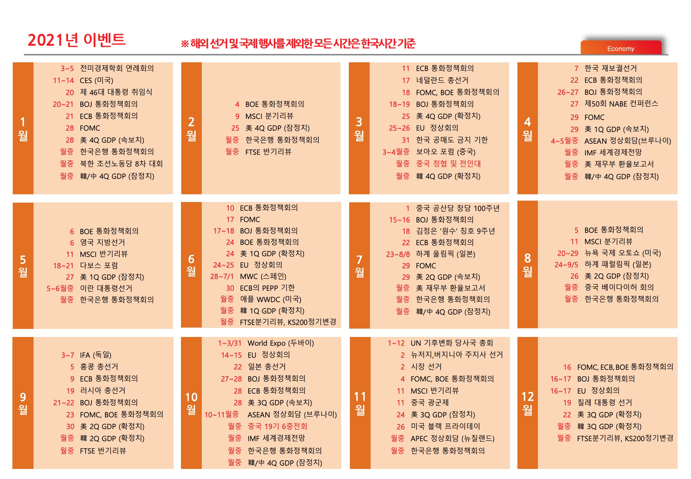

- [2021년 경제 전망: 이력 현상과 경기 회복 (SK증권 2020년 11월 11일)]( ./resource/575558.pdf )
    - [PDF]( http://consensus.hankyung.com/apps.analysis/analysis.downpdf?report_idx=575558 )
    - [한경 컨센서스 검색 결과: SK증권 2020년 11월 11일]( http://consensus.hankyung.com/apps.analysis/analysis.list?sdate=2020-11-11&edate=2020-11-11&now_page=1&search_value=OFFICE_NAME&report_type=&pagenum=20&search_text=SK%C1%F5%B1%C7&business_code= )

다음 이미지는 보고서 마지막에 있는 국제 이벤트 달력이다.

